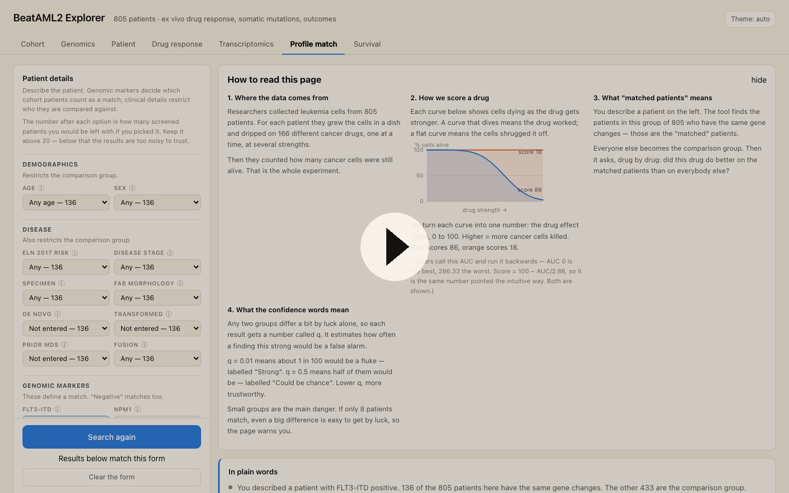

# BeatAML2 Explorer

An interactive web front end for the [BeatAML 2.0](https://biodev.github.io/BeatAML2/)
acute myeloid leukemia dataset — 805 patients with matched clinical annotation,
somatic mutation calls, and *ex vivo* inhibitor sensitivity.

## Watch it in action

[](https://vimeo.com/1217770918/4155af89e3)

**▶ [Video walkthrough of the interface](https://vimeo.com/1217770918/4155af89e3)** (Vimeo)

Seven linked views. All except Profile match are scoped by one global filter row;
Profile match takes its own patient description instead.

| View | What it answers |
|---|---|
| **Cohort** | Who is in this slice — age, risk, stage, response, most-mutated genes |
| **Genomics** | Oncoprint of the top *N* genes, co-mutation / mutual-exclusivity structure, mutation burden |
| **Patient** | One patient end to end — clinical picture, mutations drawn along each protein, their drug profile vs the cohort, most genomically similar patients |
| **Drug response** | Which inhibitors work, split by any genomic marker, a per-patient waterfall, a volcano of every test, and which drugs share a response pattern |
| **Transcriptomics** | PCA similarity map, expression-as-biomarker scatter, expression by genotype, and a co-expression heatmap |
| **Profile match** | Enter or paste a patient's markers; ranks inhibitors by how they performed on cohort patients carrying the same markers |
| **Survival** | Kaplan–Meier curves for any stratification, with a log-rank test |

The Patient view is the one to start from. It answers, for one person: what did
they carry, what did the assay actually measure (real dose–response curves, not
just AUC), what does the cohort say their genotype implies, where does their
transcriptome sit, and who else looks like them.

## Live site

Published free on GitHub Pages from `web/` via `.github/workflows/pages.yml`,
which redeploys on every push to `main`:

**https://morabitoaj-ops.github.io/beataml-explorer/**

To enable it on a fresh fork: *Settings → Pages → Source: **GitHub Actions***.
Nothing is compiled — the workflow uploads `web/` as-is. All asset paths are
relative, so the site works from a subpath without configuration.

## Running it locally

```bash
cd web
python3 -m http.server 8777
# open http://localhost:8777
```

Or use `./serve.sh`. It must be served over HTTP — opening `index.html` from the
filesystem is blocked by the browser's module and fetch rules.

No build step, no npm. D3 v7 is vendored in `web/js/lib/`, so the app works offline.

## Rebuilding the data

The payloads under `web/data/` are generated from the published release files:

```bash
python3 -m venv .venv
.venv/bin/python -m pip install pandas openpyxl scipy
.venv/bin/python etl.py          # cohort.json, mutations.json, drugs.json
.venv/bin/python etl_omics.py    # fits.json, dose/*.json, expr.json, biomarkers.json
.venv/bin/python etl_drugs.py    # druginfo.json  (needs network: queries PubChem)
```

`cohort/mutations/drugs` load on startup (4.7 MB). `fits`, `expr` and
`biomarkers` are fetched lazily the first time a view needs them, and the
measured dose–response points are sharded one file per patient, so opening a
patient pulls ~12 KB rather than the 6.3 MB whole.

### The dose–response model

The release ships probit fit parameters but not the curves. Reconstruction:

    viability(c) = Φ(intercept + β · log₁₀ c)
    AUC          = 100 · ∫ viability d(log₁₀ c)   over [min_conc, max_conc]

This is verified, not assumed: it reproduces the release's own IC50 column for
**100% of fits whose IC50 falls inside the tested concentration range** (the
other half are clamped to the assay limits, which is why a naive check reports
~50%), and the maximum achievable AUC under it, 286.33, is exactly the maximum
AUC observed in the data. `etl_omics.py` re-runs that check on every build.

`data/raw/` holds the files downloaded from the
[beataml2.0_data](https://github.com/biodev/beataml2.0_data) repo:
clinical summary, WES/targeted mutation calls, probit curve fits, drug families,
and the sample ID map.

## How the data was reshaped

The release mixes three grains: clinical rows are **per specimen** (942 rows for
805 patients), drug results are keyed by **subject**, and mutations by **DNA-seq
sample**. `etl.py` collapses everything to one record per patient:

- **Clinical** — the index specimen, preferring initial diagnosis, then relapse,
  residual, remission.
- **Mutations** — the union across every DNA-seq sample belonging to that patient.
- **Drug AUC** — the median across that patient's assayed specimens.

Precomputed in the ETL because they are cohort-wide and expensive: Fisher exact
tests for all top-gene pairs, Mann–Whitney tests for every drug × marker
combination (4,747 tests, 339 significant at q < 0.05), and Spearman correlations
across the 121 inhibitors screened in ≥ 200 patients. All p-values are
Benjamini–Hochberg adjusted. Tests shown *within the current filter slice* are
computed live in the browser and are labelled as unadjusted.

## Reading the numbers

- **AUC is area under the dose–response curve. Lower means more sensitive.** This
  is the one convention worth internalising before reading any drug panel.
- The cohort mixes initial-diagnosis, relapse, residual, and remission specimens.
  Survival is measured from **specimen collection**, so comparing a
  relapse-heavy group against a diagnosis-heavy one will look like a biological
  effect when it is a sampling one. Filter *Disease stage* to compare like with like.
- Mutation counts combine whole-exome and targeted panels, so the burden
  distribution reflects assay breadth as well as biology.
- `overallSurvival` uses `-1` as a missing sentinel in the release; those are
  dropped rather than treated as zero-day survivals.
- Curves and associations are descriptive. Nothing here adjusts for treatment,
  age, or the multiple comparisons implied by trying many stratifications.
- The genotype-implications panel reports **cohort-level** association direction
  next to that **individual's** measured AUC. The two often disagree, and the
  disagreement is usually the point — patient 2003 carries FLT3 p.D835Y, a TKD
  variant, and sits at the 58th percentile for sorafenib despite FLT3 carriers
  being sensitive on average.
- Expression variance in a mixed-sex cohort is topped by Y-linked genes and
  XIST. The heatmap excludes them by default; the toggle is on the card.
- **The consensus marker columns are not uniformly encoded.** `FLT3-ITD` and
  `NPM1` use explicit `positive`/`negative`; `RUNX1`, `ASXL1` and `TP53` instead
  carry a variant description string (e.g. `TP53 (p.R175H; 43.2%)`) when mutated
  and are blank otherwise. Parsing the second group as yes/no silently yields
  null for all 805 patients — which it did here until it was caught. `etl.py`
  now treats presence-of-text as positive and merges it with the WES calls,
  giving TP53 81, RUNX1 102 and ASXL1 90 positives, and adding 141 drug-marker
  tests that previously could not run at all.

## The Profile match tab

Describe a patient with dropdowns — age band, sex, ELN risk, disease stage,
specimen, FAB, de novo / transformed / prior MDS, fusion, and the consensus
markers (FLT3-ITD, NPM1, TP53, RUNX1, ASXL1) as positive / negative / not
entered — plus any other mutated genes. A paste box still accepts a variant
list, report text, or a MAF column and extracts recognised symbols.

Two classes of field, deliberately treated differently:

- **Genomic markers define the matched group.** "Negative" matches too, which a
  checkbox cannot express.
- **Clinical details restrict both groups**, so matched and comparison patients
  are compared like-for-like rather than confounding "matched" with "young".

Results lead with an **In plain words** card — what you entered, how many
patients matched, the strongest hit in a sentence, and whether the top drugs
converge on a shared target gene (the strongest coherence signal available:
for FLT3-ITD, 6 of the top 8 hits target FLT3). Then a **funnel** showing what
each criterion cost in sample size, the ranking, and the potency cross-check.

### Results wait for an explicit Search

The form holds a `draft`; results are computed from a separate `applied`
snapshot. Only the Search button copies one to the other, so nothing recomputes
while you are still filling the form, and a banner appears if the two diverge.
Every dropdown also carries a plain-language definition, opened by double-clicking
the dropdown or clicking its ⓘ (the ⓘ exists because double-click is neither
discoverable nor reachable from a keyboard).

### The headline answer: top 2 picks

After Search, the first thing shown is the two drugs the data points to, each
with its full reference card inline — name, approval status, active ingredient,
maker, mechanism, targets, molecular formula and other indications.

They are chosen by **rank-sum over two criteria** rather than a weighted formula
with invented coefficients: how well the drug worked in absolute terms (its own
0–100 score) and how much better it did on matched patients than on the
comparison group. A drug has to place well on both, which keeps out compounds
that merely won a race in which everything was slow. Candidates must clear
q < 0.05 and have been screened on at least **20** matched patients; if nothing
clears the sample-size bar the panel falls back to thinner evidence and says so
in the footnote, and each thin pick carries its own warning.

When no drug clears the bar the heading reads "No drug stands out" — the correct
answer for TP53 and DNMT3A profiles, and one a top-N list would otherwise hide.

### Drug reference cards

Selecting a drug — in Profile match or Drug response — shows what it actually
is. Three sources, labelled separately because they do not carry equal weight:

| Block | Source | Trust |
|---|---|---|
| What it binds | the release's own `drug_gene` table | authoritative |
| What it is made of (formula, weight, SMILES, CID) | fetched from PubChem by `etl_drugs.py` | authoritative, one-click verifiable |
| How it works / who developed it / other uses | hand-written in `web/data/drug_curated.json` | **not machine-verified** |

162 of 166 drugs matched in PubChem; 61 have a written summary. Anything without
one says so rather than inventing it, and the written blocks carry a visible
warning to check the PubChem link before relying on them.

`etl_drugs.py` fetches through `curl` rather than `urllib`: this machine sits
behind a TLS-intercepting proxy whose CA is in the system keychain but not in
Python's certifi bundle, so urllib fails closed. Shelling out keeps full
certificate verification instead of disabling it.

### Written to be readable without a biology degree

The tab opens with a collapsible **How to read this page** card: where the data
came from, a two-curve diagram of what the assay measures, what "matched
patients" means, and what a q-value is in false-alarm terms.

It also introduces a **drug effect score, 0–100, higher = better**, shown
everywhere beside the AUC. This is a pure rescaling — `score = 100 − AUC/2.8633`
— that exists solely to fix the direction: AUC runs backwards (lower is better)
and tops out at 286.33, which is the single thing every new reader gets wrong.
No information is added or lost, the AUC stays visible for anyone who wants it,
and the main chart plots the score difference so **bars to the right always mean
"worked better"**.

q-values additionally carry a plain word — Very strong / Strong / Moderate /
Weak / Could be chance — with the number still beside it.

It deliberately reports two things the ranking alone would hide:

- **n, prominently**, with a warning below 20 matched patients. A rank built on
  11 patients is not the same claim as one built on 300.
- **Absolute potency alongside relative difference.** A drug can top the
  differential ranking while being weak in absolute terms, and a broadly
  cytotoxic drug can have the lowest AUC in the cohort while being useless for
  telling patients apart. Both columns are shown, with a plain-language reading.

Clicking a drug draws the waterfall of matched vs reference patients — if the
profile really predicts response the matched patients cluster at the sensitive
end, and usually they only partly do.

Profiles are shareable: `?profile=FLT3-ITD,DNMT3A&sex=Male&age=20-39#match`.

**Naming:** the tab is "Profile match", not "best drug". It ranks evidence from
one *ex vivo* research cohort. It has no pharmacokinetics, no microenvironment
and no immune system; most of these compounds are tool compounds rather than
approved drugs; and matched-vs-reference is observational, with treatment
history differing between the groups. The in-app caveat card says the same.

## Sanity checks the build reproduces

Useful as regression tests, since all of these are established AML biology:

| Check | Expected | Observed |
|---|---|---|
| Mutation frequencies | NPM1 / DNMT3A ≈ 20%+ | 22% / 22% |
| ELN 2017 risk vs survival | Favorable > Intermediate > Adverse | log-rank p = 2e-15 |
| FLT3-ITD drug associations | FLT3 inhibitors top the list | sorafenib, sunitinib, quizartinib, midostaurin, crenolanib |
| NPM1 mutation vs HOXA9 | strongly up in NPM1c | 8.10 vs 5.79 log2, p < 1e-300 |
| Venetoclax resistance | tracks monocytic markers | CLEC7A ρ = 0.72 |
| Profile match, FLT3-ITD | FLT3 inhibitor class on top | quizartinib, crenolanib, ponatinib, gilteritinib, sunitinib |
| Profile match, TP53 | broadly drug-resistant; no strong hit | best Δ ≈ −11, all q ≫ 0.05 |

The TP53 row matters as much as the FLT3 one: the tab returns "nothing much
works here" rather than manufacturing a winner, which is the correct answer for
TP53-mutant AML and the behaviour a ranking UI most easily gets wrong.

The browser's live Mann–Whitney was cross-checked against scipy on four
profiles and agrees to the reported precision. Note that in-browser p-values use
a normal approximation with an accuracy floor of ~1e-7 and are displayed as
`<1e-7` past that; the q-values baked into `drugs.json` come from scipy and are
exact.

## Design notes

Charts follow a validated palette: three all-pairs colourblind-safe hues carry
variant class (missense / truncating / in-frame indel) with a neutral for
"other"; ELN risk uses the reserved status palette because it is an ordered
severity; magnitude uses a single-hue blue ramp and correlation a blue↔red
diverging scale with a neutral midpoint. Every chart has a table-view twin, so no
value is reachable only by hovering. Light and dark are both explicitly stepped —
the toggle cycles auto → light → dark.

## Layout

```
etl.py                 build script: raw release files -> web/data/*.json
data/raw/              downloaded BeatAML 2.0 release files
web/index.html         app shell
web/css/app.css        design tokens + layout
web/js/data.js         loading, indexing, filter store, statistics (KM, log-rank, Mann-Whitney)
web/js/charts.js       chart primitives, tooltip, table-view
web/js/views/*.js      one module per tab
web/js/lib/d3.v7.min.js
```

## Repository layout note

`data/raw/` is **not** committed — the release files total ~338 MB and the
expression matrix alone is 268 MB, past GitHub's 100 MB per-file limit. Run
`./fetch_data.sh` to download them if you want to re-run the pipeline. The
derived JSON the site actually loads **is** committed under `web/data/`, so a
fresh clone runs immediately with no build step.

## Licence

Released under **Creative Commons Attribution 4.0 International (CC-BY-4.0)** —
see `LICENSE`. You may share and adapt this, including commercially, provided
you give appropriate credit and indicate any changes.

The same licence covers the BeatAML 2.0 data redistributed under `web/data/`,
so the whole repository travels under one set of terms. (CC licences are more
usually applied to data and prose than to source code — MIT or Apache-2.0 are
the conventional software choices — but matching the upstream data licence keeps
this repository internally consistent.)

## Source & licence

Bottomly et al., "Integrative analysis of drug response and clinical outcome in
acute myeloid leukemia," *Cancer Cell* 2022. Data released under CC-BY-4.0,
genome build GRCh37. Raw sequencing is controlled-access via dbGaP/GDC — only the
published summary-level files are used here.

**This is a research and teaching tool, not a clinical decision aid.**
